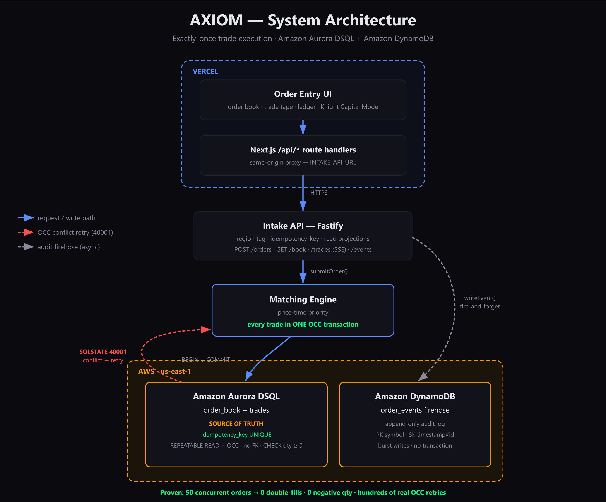

# AXIOM

**A distributed exchange core that guarantees exactly-once trade execution and one strongly consistent ledger of truth — built on Amazon Aurora DSQL.**

AXIOM is a self-contained **exchange core** — the matching engine and settlement
ledger that an emerging trading venue (a crypto exchange, prediction market, or
alternative trading system) runs *as its own* core, instead of building one or
licensing a legacy proprietary engine. AXIOM is the destination an order book
lives in; it is not a connector to Coinbase/Binance/Polymarket, and it is not a
smart order router. Venues integrate *into* it (today via REST; a FIX gateway is
the natural production front door).

Its entire thesis is **correctness under concurrency**: one match, one
settlement, no double-execution — even under a burst of duplicate or retried
orders, the exact failure that cost Knight Capital ~$440M in 2012 — and **one
strongly consistent ledger of truth even when that book is written from multiple
AWS Regions at once.**

---

## Why Aurora DSQL

A matching engine has two needs that historically forced a trade-off:

1. **Serializable correctness** for order-book state changes (a match must be
   atomic and conflict-free), and
2. **Low-latency, strongly-consistent access** across regions.

Aurora DSQL is the rare database that provides both. AXIOM relies on two of its
properties directly:

- **Optimistic concurrency control (OCC).** DSQL is lock-free and validates
  transactions at commit. Two transactions that touch the same order row cannot
  both win — the later committer is rejected with `SQLSTATE 40001` and retried.
  This is what makes double-execution structurally impossible.
- **A database-enforced `UNIQUE(idempotency_key)` constraint.** A retried or
  duplicated order submission cannot be inserted twice. This is the literal
  Knight Capital safeguard — enforced by the database, not by fallible app code.

> **Important engineering note.** Aurora DSQL does **not** support
> `SERIALIZABLE` isolation, `SELECT ... FOR UPDATE` locking, or foreign keys.
> AXIOM is built to DSQL's real concurrency model (REPEATABLE READ + OCC), not
> to a textbook Postgres assumption. See
> [docs/architecture/concurrency-model.md](docs/architecture/concurrency-model.md)
> and [ADR-001](docs/architecture/decision-records/ADR-001-aurora-dsql-occ-model.md).

---

## Architecture



| Store / layer | Role |
|---------------|------|
| **Aurora DSQL** | Order book + settlement ledger. The single source of truth, strongly consistent. |
| **DynamoDB** | High-throughput order-event firehose / audit log. |
| **Next.js on Vercel** | Dashboard + same-origin API proxy (`/api/orders`, `/api/book`, `/api/trades`, `/api/events`). |
| **Fastify intake API** | Region tagging, idempotency handling, matching, and read projections for the dashboard. |

AXIOM runs in two modes. **Single-Region** (default; local Postgres or one DSQL
cluster) is what the test suite and quickstart use. **Multi-Region** (set
`MULTIREGION=1`) connects to a real multi-Region Aurora DSQL cluster — two peered
Regional clusters (`us-east-1` + `us-east-2`) plus a witness Region (`us-west-2`)
— and routes a write by its `X-Region` tag to that Region's endpoint. Both
endpoints are **one logical, strongly-consistent database** (synchronous,
zero replication lag, RPO 0), so a trade committed via one Region is immediately
durable on the other. See [Multi-Region](#multi-region-one-ledger-across-regions)
below.

> The demo labels the `us-east-2` peer as "eu" for narrative; it is a real,
> separate AWS Region but is not literally in Europe. AXIOM keeps the habit of
> being explicit about what is real vs. labeled.

The full data-flow diagram is in
[docs/ARCHITECTURE.md](docs/ARCHITECTURE.md); rendered images live at
[docs/architecture-diagram.svg](docs/architecture-diagram.svg) /
[`.png`](docs/architecture-diagram.png).

---

## Multi-Region — one ledger across Regions

This is the answer to *"why is this hard on plain Postgres?"* Single-Region
Postgres can do exactly-once matching. What it cannot do is be **multi-Region
active-active with synchronous strong consistency and zero RPO** — its multi-
Region story is a primary plus async replicas, with a lossy failover and
post-partition reconciliation. Aurora DSQL provides active-active strong
consistency across Regions, and AXIOM exploits exactly that.

**Topology** (created by `provision:aws:multiregion`):

| Component | Region | Role |
|-----------|--------|------|
| Cluster 1 (endpoint) | `us-east-1` | Writable Regional endpoint, labeled `us` |
| Cluster 2 (endpoint) | `us-east-2` | Writable Regional endpoint, labeled `eu` |
| Witness (no endpoint) | `us-west-2` | Commit-quorum participant; no client traffic |

The matching engine is **unchanged** — a cross-Region write-write conflict
surfaces as the same `SQLSTATE 40001` and retries through `withOccRetry` exactly
as a same-Region conflict does. The only new code is the per-Region connection
layer ([packages/database/src/multiregion.ts](packages/database/src/multiregion.ts))
that opens one IAM-authenticated pool per endpoint and routes by region.

**Run it:**

```bash
npm run provision:aws:multiregion      # create peered clusters + witness (billable)
# copy the printed DSQL_ENDPOINT_* / DSQL_REGION_* / DSQL_IDENTIFIER_* into .env
npm run db:migrate:dsql:multiregion    # migrate once; verify visible from both
MULTIREGION=1 npm run proof:convergence   # write via US + EU, prove one ledger
MULTIREGION=1 npm run proof:failover      # drop US endpoint, prove EU has the truth
npm run teardown:aws:multiregion       # delete both clusters when done
```

**Actual output from a live run** (`us-east-1` + `us-east-2`, witness `us-west-2`):

```text
=== AXIOM MULTI-REGION CONVERGENCE PROOF ===
[US endpoint]  SELL 2 @ 50000 -> ACCEPTED (OPEN)
[EU endpoint]  BUY  2 @ 50000 -> ACCEPTED (FILLED, 1 fill(s))
Ledger as seen from each endpoint (must be identical):
  via US endpoint: {"open_orders":0,"trades":1,"executed_qty":"2.00000000"}
  via EU endpoint: {"open_orders":0,"trades":1,"executed_qty":"2.00000000"}
Convergence: PASS — one ledger, zero divergence

=== AXIOM MULTI-REGION FAILOVER PROOF ===
[US endpoint]  committed trade 8eace0f6-9900-4e3e-a08a-ab8d819611ba
[OUTAGE]       US endpoint connection closed — US is now unreachable.
US endpoint reachable after outage: NO  (as expected)
Committed trade readable from EU:   YES (zero data loss)
EU endpoint still accepts writes:   YES (not read-only)
Failover: PASS — surviving Region serves the same truth, no reconciliation
```

> **Honest scope of the failover proof.** It does not delete an AWS Region; it
> simulates a Region becoming unreachable *from the client* by closing the US
> pool, then proves the surviving EU endpoint already holds the committed trade
> (RPO 0) and stays writable. The durability guarantee is real (witness quorum);
> the client-side outage is what is simulated.

---

## Repository layout

```
packages/
  shared-types/      Domain vocabulary: enums, Zod validators, fixed-point decimal, typed errors
  database/          Connection pool, OCC retry runner, migration system (DSQL-aware)
  matching-engine/   The matching transaction — the ONLY writer of the trades ledger
  dynamodb-client/   order_events firehose: table setup + fire-and-forget event writers
  intake-api/        Fastify server: region tagging, idempotency, matching, read projections
apps/
  web/               Next.js 15 dashboard + same-origin API proxy (order book, trade tape, ledger, Knight Capital Mode)
tests/
  concurrency/       The correctness proofs (50 conflicting orders; 50 duplicate submissions)
  global-setup.ts    Reuses a reachable Postgres or auto-starts an embedded one (no Docker required)
scripts/
  provision-aws.ts   Provision the Aurora DSQL cluster + DynamoDB table via the AWS SDK
  migrate-dsql.ts    Apply migrations to the live DSQL cluster (CREATE INDEX ASYNC)
  aws-proof.ts       Print live AWS resource details for submission evidence
  seed-demo-data.ts  Seed a clean resting book for the demo
  load-test-intake.ts / verify-knight-capital.ts   Load + Knight Capital proofs
docs/
  ARCHITECTURE.md · DEMO.md · SUBMISSION.md         Top-level system, demo, submission docs
  architecture/      Concurrency model, database design, event flow, ADRs
  operations/        Deployment & operations runbook
```

Each package's responsibilities are justified in
[docs/architecture/database-design.md](docs/architecture/database-design.md) and
[docs/ARCHITECTURE.md](docs/ARCHITECTURE.md).

---

## Quickstart (local proof)

Requires **Node 22+**. Docker is optional — if no Postgres is reachable at
`DATABASE_URL`, the test suite auto-starts an embedded PostgreSQL, so `npm test`
runs the correctness proofs with zero infrastructure.

```bash
# 1. Install
npm install

# 2. Configure environment
cp .env.example .env        # defaults already target the local database

# 3. Run the concurrency proofs (starts an embedded Postgres if none is running)
npm test
```

The concurrency suite fires 50 simultaneous conflicting orders at the matching
transaction and asserts the book never goes negative and nothing is
double-filled, then fires 50 duplicate submissions and asserts exactly one is
accepted. See [tests/concurrency/](tests/concurrency/).

### Run the full stack (dashboard + API)

```bash
npm run db:up               # PostgreSQL 16 (55432) + DynamoDB Local (8000)
npm run db:migrate          # apply schema
npm run dynamo:setup        # create the order_events table locally
npm run api:start &         # Fastify intake API on :3001
npm run dev -w @axiom/web   # dashboard on :3000
npm run seed                # optional: resting liquidity for the demo
```

Then open `http://localhost:3000`. Reproduce the headline numbers with
`npm run loadtest` (200-order burst) and `npm run verify:knight` (Knight Capital
Mode, 5/5 runs). The full demo walkthrough is in [docs/DEMO.md](docs/DEMO.md).

Deploying to real Aurora DSQL / DynamoDB / Vercel — including the AWS-SDK
provisioning scripts — is documented in
[docs/operations/deploy.md](docs/operations/deploy.md).

---

## Project status

**Verified end-to-end (single-Region):** the matching engine + concurrency proof
(the load-bearing deliverable — `npm test` passes the 50-conflicting-order and
50-duplicate-submission proofs), the Fastify intake API, the DynamoDB firehose,
and the Next.js dashboard with Knight Capital Mode. A live Aurora DSQL cluster and
`order_events` DynamoDB table are provisioned in `us-east-1` (`npm run aws:proof`
prints their live status).

**Verified against a live multi-Region cluster.** A two-Region active-active
Aurora DSQL cluster was provisioned (`us-east-1` + `us-east-2`, witness
`us-west-2`), both clusters reached `ACTIVE`, the schema was applied once via the
US endpoint and confirmed visible from the EU endpoint, and both proofs passed
against the live cluster:

- **Convergence** (`proof:convergence`) — a SELL written through the **us-east-1**
  endpoint was matched by a BUY written through the **us-east-2** endpoint; both
  endpoints then reported the *identical* ledger (`trades=1`,
  `executed_qty=2.00000000`, `open_orders=0`). One logical ledger, zero
  divergence, no replication lag.
- **Failover** (`proof:failover`) — a trade was committed via the US endpoint, the
  US connection was then severed (US unreachable), and the surviving EU endpoint
  still (a) returned the committed trade with full fidelity — zero data loss,
  RPO 0 — and (b) accepted a new write. The surviving Region serves the same
  truth with no reconciliation step.

Reproduce with the commands in [Multi-Region](#multi-region-one-ledger-across-regions).
The clusters were torn down after the run (`teardown:aws:multiregion`), so
`aws:proof` reflects the single-Region `us-east-1` cluster used for day-to-day dev.

See [docs/architecture/](docs/architecture/) for the design rationale and
[docs/SUBMISSION.md](docs/SUBMISSION.md) for the submission summary.
