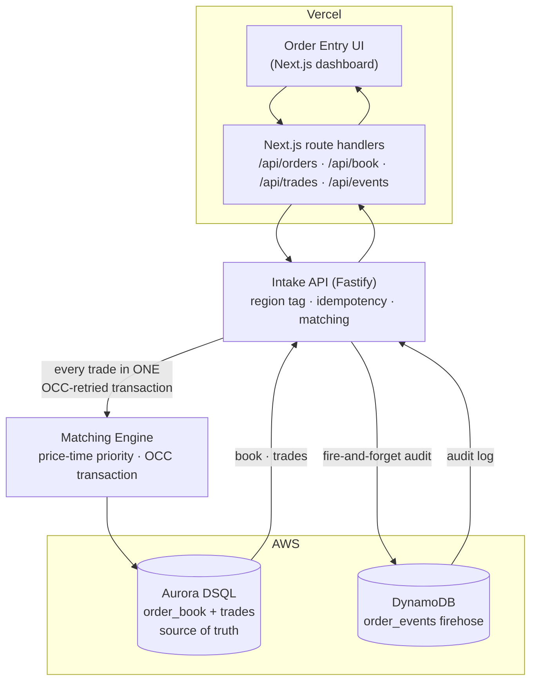

# AXIOM — Architecture

AXIOM is a distributed exchange core: an order-matching and settlement engine
that guarantees **exactly-once trade execution** and one strongly-consistent
ledger of truth, even under a burst of duplicate or retried orders.

## System diagram

## Components

| Layer | Tech | Responsibility |
|---|---|---|
| Dashboard | Next.js 15 (App Router), Tailwind | Order entry, live book, trade tape, ledger, Knight Capital Mode |
| API proxy | Next.js route handlers | Same-origin proxy to the intake API |
| Intake API | Fastify 5 | Region tagging, idempotency-key handling, read projections |
| Matching engine | TypeScript + `pg` | Price-time-priority matching inside one OCC transaction |
| Source of truth | **Aurora DSQL** | `order_book` + `trades` — strongly consistent |
| Firehose | **DynamoDB** | `order_events` audit log — burst-write, append-only |

## Why Aurora DSQL (not generic Postgres)

A matching engine needs two things that historically forced a trade-off:
serializable correctness for order-book mutations **and** low-latency, strongly
consistent access across regions. Aurora DSQL provides both via **optimistic
concurrency control (OCC)**: transactions run lock-free and are validated at
commit; two transactions that touch the same order row cannot both win — the
later committer is rejected with `SQLSTATE 40001`. Combined with a
database-enforced `UNIQUE(idempotency_key)`, double-execution becomes
*structurally impossible*, not merely guarded by application code. That is the
exact failure mode that cost Knight Capital ~$440M in 2012.

Generic Postgres could emulate the isolation, but it would abandon AXIOM's
reason to exist: DSQL delivers this guarantee with multi-region strong
consistency and serverless scale that emerging venues cannot otherwise afford.

> AXIOM is built to Aurora DSQL's **real** semantics: isolation is fixed at
> REPEATABLE READ, there is no `FOR UPDATE` locking and no foreign keys.
> Correctness comes from OCC conflict-detection + the UNIQUE constraint, not
> from SQL keywords DSQL does not implement. See
> [architecture/concurrency-model.md](architecture/concurrency-model.md) and
> [ADR-001](architecture/decision-records/ADR-001-aurora-dsql-occ-model.md).

## Why DynamoDB for the firehose (not Aurora DSQL)

The order-event log is a high-throughput, append-only, single-item-write
workload that needs no cross-row transaction. DynamoDB (partition key `symbol`,
sort key `event_sk = <ISO8601>#<order_id>`) absorbs bursts cheaply and keeps
audit writes off the critical settlement path — they are fire-and-forget, so a
firehose hiccup can never delay or fail a trade.

## The OCC retry mechanism, in plain English

1. A transaction reads the relevant order rows from a consistent snapshot.
2. It computes fills and writes the affected rows + the trade — all locally.
3. At COMMIT, the database checks whether any row it touched was changed by
   another transaction that committed first. If so, this transaction is rejected
   (`40001`).
4. AXIOM catches `40001` and simply re-runs the whole transaction against a
   fresh snapshot. Because contending matchers always write the *same* order
   rows, the loser re-reads the already-updated quantity and matches correctly.

Net effect: the book can never be double-filled or driven negative, and a
retried/duplicate order can never execute twice.

## Proven, not asserted

Run locally with `npm test`:

- **Concurrency:** 50 simultaneous conflicting orders vs. 10 units of liquidity →
  exactly `10.00000000` executed, 10 trades, min remaining 0, 0 orphan trades,
  with hundreds of real OCC retries observed (the exact count varies per run, as
  it depends on transaction scheduling under contention).
- **Idempotency:** 50 simultaneous same-key submissions → 1 accepted, 49
  REJECTED_DUPLICATE.
- **Intake load:** 200 concurrent orders → 200/200 accepted, 200/200 firehose
  events (no dropped writes), p99 ~1.1s.
- **Knight Capital Mode:** 5/5 runs → exactly 1 execution + 19 DB-rejected
  duplicates each time.

## Repository map

See [../README.md](../README.md#repository-layout).
